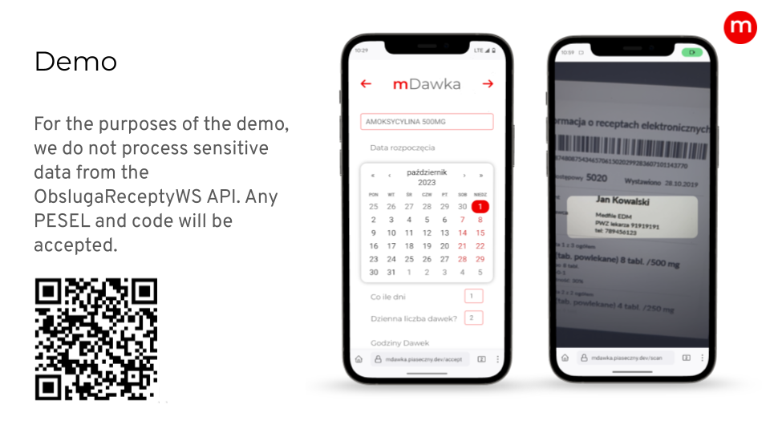

# mDawka: Pill Scheduler with E-Prescription Integration

mDawka (mała Dawka) is a convenient pill manager levaraging `webCal` and an e-recepta API to deliver an easy and usefull pull scheduler.

## Installation

- Clone this repository to your local machine
- Run `docker compose up` to build and run the development version of the project

## Technologies Used

- `Next.js`
- `MongoDB`
- `Echo (for golang)`

## Product images

    

    

## License

mDawka is open-source software licensed under the [MIT License](LICENSE).
